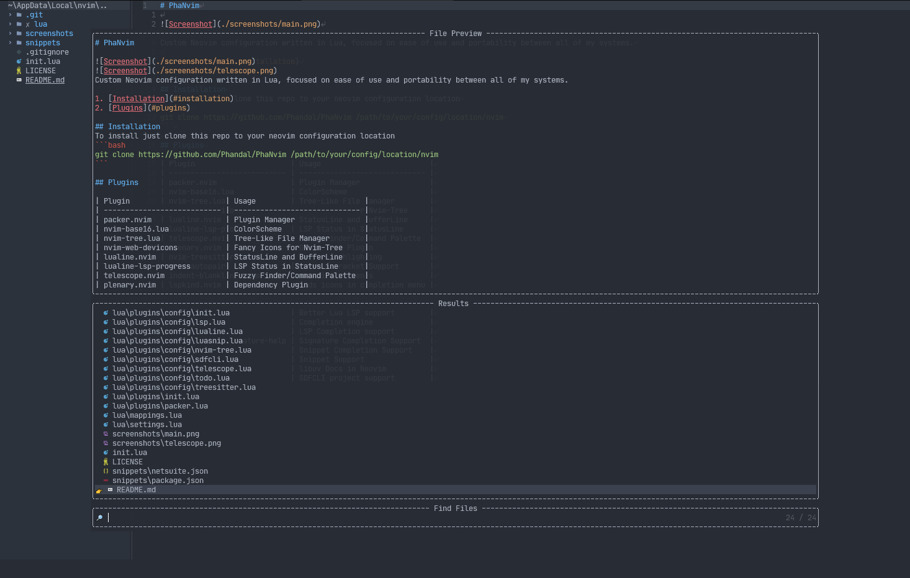

# PhaNvim



Custom Neovim configuration written in Lua, focused on ease of use and portability between all of my systems.

1. [Installation](#installation)
2. [Plugins](#plugins)

## Installation
To install just clone this repo to your neovim configuration location
```bash
git clone https://github.com/Phandal/PhaNvim /path/to/your/config/location/nvim
```

## Plugins

| Plugin                      | Usage                         |
| --------------------------- | ----------------------------- |
| packer.nvim                 | Plugin Manager                |
| nvim-base16.lua             | ColorScheme                   |
| nvim-tree.lua               | Tree-Like File Manager        |
| nvim-web-devicons           | Fancy Icons for Nvim-Tree     |
| lualine.nvim                | StatusLine and BufferLine     |
| telescope.nvim              | Fuzzy Finder/Command Palette  |
| plenary.nvim                | Dependency Plugin             |
| nvim-treesitter             | Syntax Highlighting           |
| nvim-autopairs              | Closing Bracket Support       |
| indent-blankline.nvim       | Highlight Indents             |
| lspkind.nvim                | Adds icons in completion menu |
| nvim-lspconfig              | Server Configurations for LSP |
| lua-dev.nvim                | Better Lua LSP support        |
| nvim-cmp                    | Completion engine             |
| cmp-nvim-lsp                | LSP Completion support        |
| cmp-nvim-lsp-signature-help | Signature Completion Support  |
| cmp-luasnip                 | Snippet Completion Support    |
| LuaSnip                     | Snippet Support               |
| luv-vimdocs                 | libuv Docs in Neovim          |
| sdfcli.nvim                 | SDFCLI project support        |
