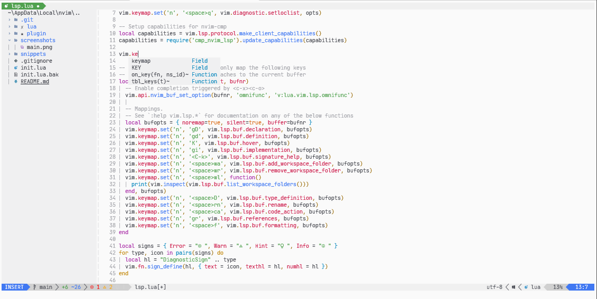

# PhaNvim


Custom Neovim configuration written in Lua, focused on ease of use and portability between all of my systems.

1. [Installation](#installation)
2. [Plugins](#plugins)

## Installation
To install just clone this repo to your neovim configuration location
```bash
git clone https://github.com/Phandal/nvim-init
```

## Plugins
